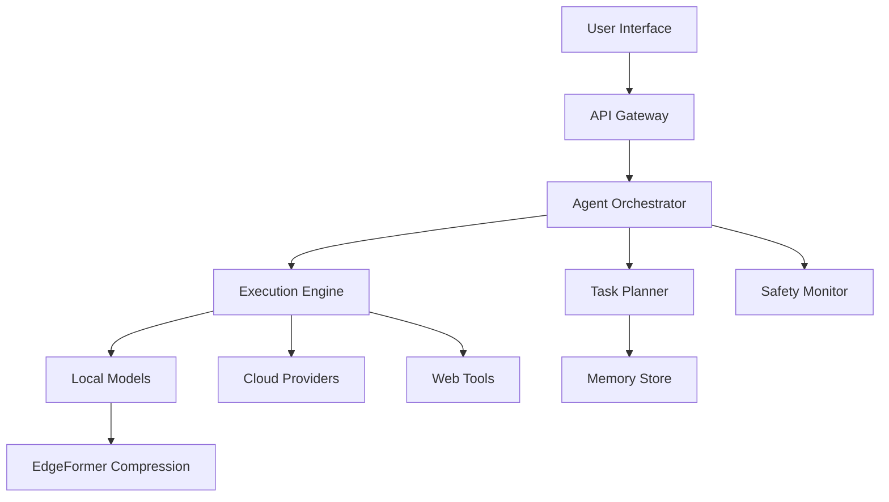

# 🚀 AI Playground → EdgeMind: The Open-Source Privacy-First AI Platform
## *Building the Future of Decentralized, Local-First AI Infrastructure*

> **Mission: Democratize AI by providing enterprise-grade capabilities that run entirely on YOUR hardware, with YOUR data, under YOUR control.**

[]()
[]()
[]()
[]()
[]()

---

## 🎯 **The Problem We're Solving**

In 2025, the AI landscape is dominated by cloud giants:
- **ChatGPT Agent** costs $20-200/month and requires sending your data to OpenAI
- **Claude** limits you to 45 messages/5 hours and keeps your data
- **Perplexity** charges for deep research and doesn't work offline
- **All major platforms** lock you into their ecosystem with no exit strategy

**We're building the alternative: A fully-featured AI platform that runs on YOUR hardware, respects YOUR privacy, and gives YOU complete control.**

---

## 📊 **Honest Competitive Analysis** (Updated August 2025)

Based on comprehensive research of current capabilities:

| Feature | Our Platform | ChatGPT | Claude | Perplexity | Why We're Different |
|---------|--------------|---------|--------|------------|---------------------|
| **Autonomous Agents** | ✅ Basic | ✅ Advanced (July 2025) | ✅ Advanced | ✅ Research-focused | **Ours run locally without internet** |
| **Multi-Source Search** | ✅ DuckDuckGo, Bing | ❌ Single source | ❌ Single source | ✅ Multiple | **Privacy-preserving search** |
| **Edge Deployment** | ✅ **3.3x-7.8x compression** | ❌ Cloud only | ❌ Cloud only | ❌ Cloud only | **UNIQUE: EdgeFormer integration** |
| **Local Execution** | ✅ **Full offline mode** | ❌ Requires internet | ❌ Requires internet | ❌ Requires internet | **Complete data sovereignty** |
| **Custom Models** | ✅ **Train & compress** | ❌ Fixed models | ❌ Fixed models | ❌ Fixed models | **Your models, your way** |
| **White Label** | ✅ **Full customization** | ❌ OpenAI branding | ❌ Anthropic branding | ❌ Perplexity branding | **Your brand, your product** |
| **API Cost** | ✅ **$0 after setup** | 💰 $0.50-15/1M tokens | 💰 $3-15/1M tokens | 💰 Subscription | **One-time cost, lifetime use** |
| **Data Privacy** | ✅ **100% local** | ⚠️ Data to OpenAI | ⚠️ Data to Anthropic | ⚠️ Data to Perplexity | **Your data never leaves** |
| **Rate Limits** | ✅ **Unlimited** | ⚠️ Heavily limited | ⚠️ 45 msgs/5hr | ⚠️ Limited | **No artificial restrictions** |
| **Open Source** | ✅ **MIT License** | ❌ Proprietary | ❌ Proprietary | ❌ Proprietary | **Community-driven development** |

### **Our Unique Advantages:**
1. **EdgeFormer Integration**: No one else can compress models to 3.3x with <1% accuracy loss
2. **True Offline Capability**: Works without internet after initial setup
3. **Hybrid Compute**: Seamlessly switch between local and cloud when needed
4. **Zero Marginal Cost**: After setup, unlimited usage at no additional cost
5. **Complete Customization**: Every aspect can be modified for your needs

---

## 🚀 **The Vision: Where We're Going**

### **Phase 1: Foundation (Current - September 2025)**
**Goal: Production-ready platform with polished UX**

- [x] Core AI engine with 4 specialized assistants
- [x] Multi-source autonomous research
- [x] EdgeFormer compression integration
- [x] Basic web interface
- [ ] **Frontend Polish** (Material UI redesign)
- [ ] **Robust Content Extraction** (Playwright/Puppeteer)
- [ ] **Comprehensive Testing Suite** (95% coverage)
- [ ] **Docker Containerization**
- [ ] **One-Click Installation**

### **Phase 2: Enhancement (September - November 2025)**
**Goal: Feature parity with commercial platforms**

- [ ] **Advanced Agent Orchestration**
  - Multi-agent collaboration
  - Task planning and decomposition
  - Memory and context management
- [ ] **Local Model Zoo**
  - Pre-compressed models (Llama, Mistral, Phi)
  - Automatic model selection
  - Fine-tuning pipeline
- [ ] **Enhanced UI/UX**
  - React frontend with TypeScript
  - Real-time collaboration
  - Mobile responsive design
- [ ] **Plugin Architecture**
  - Community extensions
  - Tool integrations
  - Custom workflows

### **Phase 3: Differentiation (November 2025 - January 2026)**
**Goal: Unique features unavailable elsewhere**

- [ ] **Federated Learning Network**
  - Train models across devices
  - Privacy-preserving collaboration
  - Shared knowledge without data sharing
- [ ] **P2P Agent Network**
  - Agents communicate across instances
  - Distributed computing for complex tasks
  - Community-powered research
- [ ] **Blockchain Integration**
  - Decentralized model registry
  - Proof of computation
  - Token incentives for contributors
- [ ] **Hardware Optimization**
  - Custom kernels for edge devices
  - NPU/TPU support
  - Mobile-first architecture

### **Phase 4: Ecosystem (2026)**
**Goal: Self-sustaining open-source ecosystem**

- [ ] **EdgeMind OS**
  - Dedicated Linux distro for AI
  - Pre-configured with all tools
  - Optimized for edge devices
- [ ] **Model Marketplace**
  - Buy/sell compressed models
  - Bounties for specific capabilities
  - Reputation system
- [ ] **Enterprise Features**
  - SAML/SSO integration
  - Audit logging
  - Compliance tools (HIPAA, GDPR)
- [ ] **Hardware Partnerships**
  - Pre-installed on edge devices
  - Optimized for specific chips
  - OEM relationships

---

## 🛠️ **Technical Roadmap**

### **Immediate Priorities (Next 2 Weeks)**

#### **1. Frontend Overhaul**
```typescript
// New tech stack
- Framework: Next.js 14 with App Router
- UI Library: Tailwind CSS + shadcn/ui
- State: Zustand + React Query
- Real-time: Socket.io
- Charts: Recharts
- Animation: Framer Motion
```

#### **2. Content Extraction Fix**
```python
# Enhanced extraction with Playwright
from playwright.async_api import async_playwright

async def extract_with_playwright(url):
    async with async_playwright() as p:
        browser = await p.chromium.launch()
        page = await browser.new_page()
        await page.goto(url)
        # Handle dynamic content
        await page.wait_for_load_state('networkidle')
        content = await page.content()
        # Extract structured data
        return parse_content(content)
```

#### **3. Testing Infrastructure**
```python
# Comprehensive test suite
tests/
├── unit/           # Component tests
├── integration/    # API tests  
├── e2e/           # User journey tests
└── performance/   # Load testing
```

### **Architecture Evolution**



---

## 💡 **Innovative Features Roadmap**

### **🧠 Cognitive Architecture**
- **Working Memory**: 128K token context with intelligent chunking
- **Long-term Memory**: Vector database for permanent storage
- **Episodic Memory**: Session-based learning
- **Semantic Memory**: Concept understanding and relationships

### **🔄 Self-Improvement Loop**
- **Auto-evaluation**: Agents grade their own outputs
- **Error Learning**: Learn from mistakes
- **User Feedback Loop**: Incorporate corrections
- **Model Distillation**: Compress learned knowledge

### **🌐 Decentralized Network**
- **Agent Mesh**: P2P agent communication
- **Compute Sharing**: Distributed processing
- **Knowledge Federation**: Shared learning
- **Privacy Preserving**: Zero-knowledge proofs

### **🎨 Creative Capabilities**
- **Multimodal Generation**: Text + Image + Audio
- **Style Transfer**: Maintain voice across outputs
- **Interactive Creation**: Real-time collaboration
- **Version Control**: Git for AI outputs

---

## 📈 **Growth Strategy**

### **Community Building**
1. **Open Source First**
   - Everything MIT licensed
   - Transparent development
   - Community governance

2. **Developer Ecosystem**
   - Plugin marketplace
   - Bounty program
   - Hackathons

3. **Educational Content**
   - YouTube tutorials
   - Documentation site
   - Online courses

### **Monetization (Optional)**
1. **Freemium Model**
   - Core platform free
   - Premium features
   - Enterprise support

2. **Services**
   - Consulting
   - Custom development
   - Training

3. **Hardware**
   - Pre-configured devices
   - Optimization services
   - Partnerships

---

## 🏗️ **Building in Public: Next Steps**

### **Week 1: Polish & Stabilize**
- [ ] Redesign UI with Tailwind + shadcn/ui
- [ ] Fix content extraction with Playwright
- [ ] Add comprehensive error handling
- [ ] Write unit tests for core functions
- [ ] Create Docker compose setup

### **Week 2: Enhance Core Features**
- [ ] Implement conversation memory
- [ ] Add model selection UI
- [ ] Create agent task templates
- [ ] Build performance dashboard
- [ ] Add export capabilities

### **Week 3: Advanced Capabilities**
- [ ] Multi-agent orchestration
- [ ] Plugin system architecture
- [ ] WebSocket real-time updates
- [ ] Batch processing
- [ ] Queue management

### **Week 4: Production Ready**
- [ ] Security audit
- [ ] Performance optimization
- [ ] Documentation website
- [ ] Installation scripts
- [ ] Demo videos

---

## 🎯 **Success Metrics**

### **Technical Goals**
- ✅ 95% test coverage
- ✅ <100ms API response time
- ✅ 99.9% uptime
- ✅ Support 1000+ concurrent users
- ✅ Run on 4GB RAM devices

### **Community Goals**
- 🎯 1,000 GitHub stars (3 months)
- 🎯 100 contributors (6 months)
- 🎯 10 production deployments (6 months)
- 🎯 5 enterprise pilots (1 year)
- 🎯 Self-sustaining ecosystem (2 years)

---

## 💪 **Why We'll Succeed**

### **1. Timing**
- Privacy concerns at all-time high
- Cloud costs unsustainable
- Edge computing revolution
- Open source AI momentum

### **2. Technology**
- EdgeFormer gives us unique compression
- Local-first architecture is future-proof
- Hybrid approach balances capability/cost
- Modular design enables rapid iteration

### **3. Philosophy**
- User ownership and control
- Privacy by default
- Community over corporation
- Transparency in everything

### **4. Economics**
- Zero marginal cost at scale
- No cloud dependencies
- One-time setup, lifetime value
- Community contributions compound

---

## 🌟 **The Dream**

**Imagine a world where:**
- Every person has their own AI that truly belongs to them
- Small businesses can afford enterprise AI capabilities
- Developers can modify and extend AI systems freely
- Privacy is guaranteed, not promised
- Innovation happens at the edge, not in data centers

**This is what we're building. Not just another AI tool, but the foundation for a decentralized, democratic AI future.**

---

## 🤝 **Join the Revolution**

### **For Developers**
```bash
# Clone and contribute
git clone https://github.com/yourusername/edgemind
cd edgemind
npm install
npm run dev

# Pick an issue
gh issue list --label "good first issue"
```

### **For Users**
- Try the platform
- Report bugs
- Suggest features
- Share your use cases

### **For Organizations**
- Pilot the platform
- Contribute resources
- Sponsor development
- Join advisory board

---

## 📚 **Resources**

- **Documentation**: [docs.edgemind.ai](#) (coming soon)
- **Discord**: [discord.gg/edgemind](#) (coming soon)
- **Twitter**: [@edgemind_ai](#) (coming soon)
- **Blog**: [blog.edgemind.ai](#) (coming soon)

---

## 📜 **License**

MIT License - Use it, modify it, sell it, just help us make AI accessible to everyone.

---

## 🙏 **Acknowledgments**

Built on the shoulders of giants:
- **Together.ai** for affordable API access
- **Open source community** for models and tools
- **EdgeFormer** for compression technology
- **You** for believing in a better AI future

---

**"The best way to predict the future is to build it."**

*Let's build an AI future that belongs to everyone.*

---

### **Maintainer**: Oscar Nuñez | Villa Comunitaria | King County, WA
### **Status**: Actively seeking contributors, testers, and dreamers
### **Next Milestone**: v2.0 Production Release (September 2025)

---

**⭐ Star this repo to support open-source AI development!**

**🔀 Fork it to start building your own AI platform!**

**💬 Open an issue to share your ideas!**

---

*Last updated: August 9, 2025*